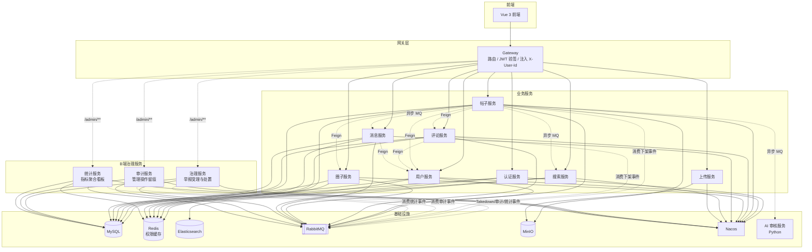

# 次元小站 (Cyxz)

面向 ACGN 爱好者的轻量级社区平台，支持多圈子内容发布、社交互动与创作管理。采用 Spring Cloud 微服务架构，前后端分离，面向学习与个人项目展示。

## 技术栈

| 层级 | 技术 |
|---|---|
| 后端框架 | Spring Boot 3.5 + Spring Cloud 2025 + Spring Cloud Alibaba |
| 服务治理 | Nacos（注册发现 + 配置中心）、Spring Cloud Gateway |
| 安全鉴权 | JWT（仅存 userId）+ Redis Cache-Aside 权限缓存 + Spring Security |
| 数据层 | MySQL 8 + MyBatis-Plus、Redis、MinIO |
| 消息队列 | RabbitMQ（通知异步、ES 数据同步、死信队列） |
| 搜索引擎 | Elasticsearch 8 + IK 中文分词 |
| 实时通信 | WebSocket（私信推送、在线状态） |
| AI 审核 | 独立 Python 服务（FastAPI） |
| 前端 | Vue 3 + TypeScript + Vite + Pinia |
| 组件库 | Element Plus + Iconify |
| 部署 | Docker Compose 一键编排（14 个业务服务 / 稳态 20 容器） |
| CI | GitHub Actions |

## 系统架构



### 鉴权链路

```
客户端 → Gateway（JWT 验签，剥离伪造信任头，注入 X-User-Id / X-Token-Remaining）
       → HeaderAuthenticationFilter（按 userId 从 Redis 加载权限到 SecurityContext，TTL 对齐 Token 剩余时间）
       → AdminRoleFilter（管理员角色校验）
       → 业务 Controller（@CurrentUser / @AdminUser / @circlePerm 注解）
```

JWT 精简为仅存 userId，角色/权限码通过 Redis Cache-Aside 按需加载，变更时旁路删 key 失效缓存；权限缓存 TTL 与 Token 剩余时间对齐，Token 失效缓存必然已过期。

## 核心功能

- **用户系统**：注册登录、JWT 鉴权、图形验证码、个人资料管理
- **内容创作**：发帖（普通帖/文章帖）、草稿、发布前敏感词检测、AI 内容审核
- **圈子体系**：多圈子、板块模板、圈子成员管理、圈子帖子计数
- **社交互动**：点赞、评论（含楼中楼）、收藏、关注/粉丝
- **消息通知**：点赞/评论/关注通知、未读数、WebSocket 实时推送
- **私信系统**：一对一私信、会话列表、在线状态
- **全文搜索**：ES 索引同步（MQ 异步）、IK 中文分词、关键词高亮
- **创作中心**：作品数据统计、互动趋势、月度报表
- **平台治理（B 端）**：举报处置（下架联动 post/comment/ES）、帖子审核（AI 初审 + 人工复审）、审计日志、平台数据看板、建圈/入圈两级审批
- **管理后台（B 端）**：用户管理（封禁/解禁）、角色权限（6 角色 35 权限码）、圈子管理、板块模板、帖子管理，共 11 个管理模块
- **圈主工作台（B 端下沉）**：圈内发帖审核、成员管理（晋升/降级/移除）、圈内板块编排，圈子级 RBAC 授权

## 项目结构

```
cyxz/
├── cyxz-gateway/        # API 网关（路由、JWT 验签、注入 X-User-Id）
├── cyxz-auth/           # 认证服务（登录注册、JWT、RBAC 角色权限）
├── cyxz-user/           # 用户服务（资料懒加载、关注关系）
├── cyxz-post/           # 帖子服务（发布、审核、互动、AI 审核）
├── cyxz-comment/        # 评论服务（评论、楼中楼、点赞）
├── cyxz-circle/         # 圈子服务（圈子、板块、成员、权限缓存失效）
├── cyxz-message/        # 消息服务（通知、私信、WebSocket）
├── cyxz-search/         # 搜索服务（ES 索引、全文检索）
├── cyxz-upload/         # 上传服务（MinIO 图床）
├── cyxz-governance/     # 治理服务（举报受理、处置事件下发）
├── cyxz-audit/          # 审计服务（管理操作事件留痕、查询）
├── cyxz-analytics/      # 统计服务（指标事件聚合、B 端看板）
├── cyxz-common/         # 公共模块（异常、配置、常量、工具）
├── cyxz-security/       # 安全模块（权限缓存、Filter 链、权限注解）
├── cyxz-*-api/          # 各服务 Feign API + VO（auth/user/post/comment/circle/message/governance/audit）
├── cyxz-ai/             # AI 审核服务（Python / FastAPI）
├── cyxz-frontend/       # Vue 3 前端项目
├── db/                  # 数据库初始化脚本（init.sql）
├── docker/              # Docker 部署（compose、Dockerfile、DEPLOY.md）
├── docs/                # 设计文档
└── .github/workflows/   # CI 配置
```

## 技术亮点

> 以下为项目已落地的工程实践，持续迭代中。

- **权限 Cache-Aside + TTL 跟随 Token**：JWT 精简为仅存 userId，角色/权限码通过 `GlobalPermissionProvider` 从 Redis 加载（Cache-Aside 模式），缓存 TTL 对齐 Token 剩余时间（网关注入 `X-Token-Remaining`），角色变更 / 圈子成员变更 / 登出时旁路删 key 失效缓存，避免权限头伪造与回收延迟
- **Token 无感续期**：前端请求层 401 拦截 + single-flight 单飞刷新（并发 401 共享同一刷新 Promise，避免旧 Token 拉黑后二次刷新误登出）+ 原请求重放，续期同时同步最新权限码
- **统一响应与异常处理**：`Result` + `BusinessException` + `GlobalExceptionHandler`，全局错误码管理，避免 try-catch 散落
- **Redis 缓存策略**：帖子详情 + 列表 + 权限缓存均采用 Cache-Aside（写后失效），列表缓存命中仅补填 liked/collected 用户态，统一 key 命名规范（`CacheKeyConstants`）
- **RabbitMQ 异步解耦**：通知发送、ES 索引同步、AI 审核走 MQ，死信队列兜底消费失败消息
- **Feign 服务间调用**：`FallbackFactory` 统一降级，返回安全默认值，避免调用方异常处理模板
- **帖子状态机**：`PostStatus` 流转规则表 + `canTransition` 校验，乐观锁条件更新防止并发覆盖
- **跨服务最终一致性**：`TransactionSynchronizationManager.afterCommit` 事务提交后执行 Feign 调用与 MQ 发送，避免长事务持有 DB 连接及事务回滚后的幻象副作用；权限缓存删除统一走 `TransactionUtils.afterCommit` 封装
- **线程池隔离防雪崩**：AI 审核（秒级慢 HTTP）与帖子详情并行查询（毫秒级快任务）使用独立线程池（`aiReviewExecutor` / `postQueryExecutor`），避免 `ForkJoinPool.commonPool` 快慢任务混跑导致雪崩；RestTemplate 强制超时防止线程无限阻塞
- **ES 同步失败补偿**：MQ 发送失败时写入 Redis 失败队列，定时任务自动重试，避免生产端发送失败导致 DB-ES 永久不一致
- **消费端幂等保护**：统计/计数事件全链路携带 eventId，消费端 Redis SETNX 去重 + Analytics 用 ON DUPLICATE KEY 原子 UPSERT、Audit 用 event_id 唯一索引、ES 用 _id 天然幂等，消息重复投递不产生脏数据
- **AI 审核 fail-closed**：AI 服务返回空/序列化失败/调用异常一律不放行——拒绝或转人工审核，安全组件失败方向朝"拒绝"，违规内容不可能因 AI 故障自动放行
- **权限提升防护**：站主（SITE_OWNER）账号禁止被平台管理员禁用/提权，内置角色权限禁止修改，角色分配受层级约束
- **MyBatis-Plus 自动填充**：`BaseEntity` 抽取公共字段 + `MyMetaObjectHandler` 自动填充创建/更新时间
- **定时计数汇总**：帖子/评论/圈子计数异步累加 + 定时刷库，避免实时写压力
- **Docker 一键部署**：多阶段构建 + maven-deps 依赖预构建镜像，14 个业务服务（稳态 20 容器）一键编排，拉代码即跑

## 快速启动

提供两种方式，详细步骤见 [docker/DEPLOY.md](docker/DEPLOY.md)。

### Docker 一键部署（推荐新人）

```bash
cd docker
cp .env.example .env          # 编辑密码（DB_PASSWORD / MINIO / JWT_SECRET 等）
.\deploy.ps1                  # 一键构建并启动 14 个业务服务（稳态 20 容器）
docker compose ps             # 验证全部 Up / Healthy
```

访问 http://localhost:80 即可使用。首次部署内置站主账号 `admin / Admin@123`（演示账号，请登录后立即在管理后台修改密码）。前置条件仅需 [Docker Desktop](https://www.docker.com/products/docker-desktop/)（8GB+ 内存）。

### 本地开发模式

中间件用 Docker 跑，前端 Vite 热更新 + 后端 IDEA 直启：

```bash
cd docker && docker compose up -d mysql redis rabbitmq nacos elasticsearch minio minio-init

# 后端：设置 JWT_SECRET 环境变量后，按依赖顺序 mvn spring-boot:run -pl <service>
# 前端：cd cyxz-frontend && npm install && npm run dev   # http://localhost:3000
```

> 完整步骤、访问地址表、常用命令、构建说明见 [docker/DEPLOY.md](docker/DEPLOY.md)。

## CI/CD

项目使用 GitHub Actions 进行持续集成（见 `.github/workflows/ci.yml`）：

- **后端**：JDK 17 编译 + 单元测试（全模块 `mvn test`，含 cyxz-post / cyxz-comment / auth / circle / message / upload / user / common）
- **前端**：Node 22 安装依赖 + 单元测试 + 生产构建

## 提交规范

提交信息采用 Conventional Commits 格式且**必须带 body**（为什么 / 怎么改 / 影响面）。type 与 scope 对照表、完整示例见 [COMMIT_CONVENTION.md](COMMIT_CONVENTION.md)。

## 设计文档

项目根目录 `docs/` 下记录了关键架构决策与迭代思考，均基于代码核对：

### 产品设计（`docs/产品设计/`）
- `产品设计.md` — 产品方向、用户画像、差异化定位与功能矩阵
- `产品现状诊断.md` — 用户旅程断点、垂直化兑现度、冷启动就绪度诊断

### 架构设计（`docs/架构设计/`）
- `模块架构与B端演进.md` — 模块职责、架构亮点、演进路线
- `技术亮点详解.md` — 14 项技术亮点卡片：问题 / 方案 / 反事实 / 追问预演
- `B端能力与模块划分评审.md` — B 端能力完整度与模块边界评审
- `数据库索引设计.md` — 24 张业务表、58 个索引设计

### 功能设计（`docs/功能设计/`）
- `功能全景图.md` — 9 大业务域功能索引：C 端 18 路由 + B 端 11 tab + internal 接口清单
- `核心功能链路.md` — 9 条跨服务核心链路时序图 + 设计决策 + FAQ
- `圈子化设计.md` — 圈子领域模型（模板 + 关联两层结构）与计数同步
- `消息通知与关注动态方案.md` — MQ 异步通知 + WebSocket 实时推送 + 私信
- `AI能力设计.md` — Python AI 审核服务（文本 + 图片多模态）与 fail-closed 策略
- `管理后台设计.md` — 两段式管理员鉴权 + 帖子状态机审核流程
- `权限设计.md` — 多租户 RBAC + SpringSecurity 方法级授权 + Cache-Aside 权限缓存
- `社区氛围功能设计.md` — 互动反馈层已实现 + 签到/成就/排行规划
- `多语言演进路线图.md` — 跨语言架构现状（Java + Python）与演进规划

### 开发计划（`docs/开发计划/`）
- `后续待办清单.md` — P0-P3 优先级任务与修复记录

### 测试报告（`docs/测试报告/`）
- `代码审查与修复总结报告.md` — 六维审查 + 5 阶段修复总记录
- `压测报告.md` / `压测优化分析报告.md` — 压测结果与瓶颈定位、优化方案
- `缓存优化验证报告.md` / `限流与压测验证报告.md` — 缓存命中率与限流阈值验证
- `收工报告.md` — 项目收尾检查（最终复查清单、Git 状态、暂缓项）

> 完整索引与各文档同步状态见 [docs/README.md](docs/README.md)。

## License

本项目基于 [MIT License](./LICENSE) 开源，仅供学习与个人使用。
