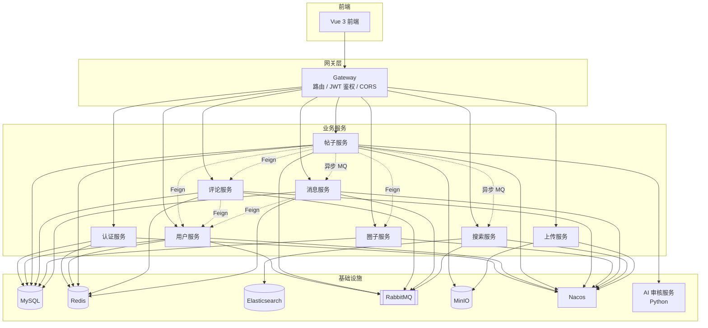

# 次元小站 (Cyxz)

面向 ACGN 爱好者的轻量级社区平台，支持多圈子内容发布、社交互动与创作管理。采用 Spring Cloud 微服务架构，前后端分离，面向学习与个人项目展示。

## 技术栈

| 层级 | 技术 |
|---|---|
| 后端框架 | Spring Boot 3.5 + Spring Cloud 2025 |
| 服务治理 | Nacos（注册发现 + 配置中心）、Spring Cloud Gateway |
| 数据层 | MySQL 8 + MyBatis-Plus、Redis、MinIO |
| 消息队列 | RabbitMQ（通知异步、ES 数据同步、死信队列） |
| 搜索引擎 | Elasticsearch（全文检索、高亮） |
| 实时通信 | WebSocket（私信推送、在线状态） |
| AI 审核 | 独立 Python 服务（FastAPI） |
| 前端 | Vue 3 + TypeScript + Vite 8 + Pinia |
| 组件库 | Element Plus + Iconify |
| CI | GitHub Actions |

## 系统架构



## 核心功能

- **用户系统**：注册登录、JWT Token 鉴权、图形验证码、个人资料管理
- **内容创作**：发帖（普通帖/文章帖）、草稿、发布前敏感词检测、AI 内容审核
- **圈子体系**：多圈子、板块模板、圈子成员管理、圈子帖子计数
- **社交互动**：点赞、评论（含楼中楼）、收藏、关注/粉丝
- **消息通知**：点赞/评论/关注通知、未读数、WebSocket 实时推送
- **私信系统**：一对一私信、会话列表、在线状态
- **全文搜索**：ES 索引同步（MQ 异步）、关键词高亮
- **创作中心**：作品数据统计、互动趋势、月度报表
- **管理后台**：用户管理、帖子审核、圈子管理

## 项目结构

```
cyxz/
├── cyxz-gateway/        # API 网关（路由、JWT 鉴权、CORS）
├── cyxz-auth/           # 认证服务（登录注册、Token、用户管理）
├── cyxz-user/           # 用户服务（资料、关注关系）
├── cyxz-post/           # 帖子服务（发布、审核、互动、AI 审核）
├── cyxz-comment/        # 评论服务（评论、楼中楼、点赞）
├── cyxz-circle/         # 圈子服务（圈子、板块、成员）
├── cyxz-message/        # 消息服务（通知、私信、WebSocket）
├── cyxz-search/         # 搜索服务（ES 索引、全文检索）
├── cyxz-upload/         # 上传服务（MinIO 图床）
├── cyxz-common/         # 公共模块（异常、配置、常量、工具）
├── cyxz-auth-api/       # 认证 API（JwtUtil）
├── cyxz-user-api/       # 用户 API（Feign + VO）
├── cyxz-post-api/       # 帖子 API（Feign + VO）
├── cyxz-comment-api/    # 评论 API（Feign）
├── cyxz-circle-api/     # 圈子 API（Feign）
├── cyxz-message-api/    # 消息 API（Feign + 事件 + 常量）
├── cyxz-ai/             # AI 审核服务（Python / FastAPI）
├── db/                  # 数据库初始化脚本
├── docs/                # 设计文档
└── cyxz-frontend/       # Vue 3 前端项目
```

## 技术亮点

> 以下为项目已落地的工程实践，持续迭代中。

- **统一响应与异常处理**：`Result` + `BusinessException` + `GlobalExceptionHandler`，全局错误码管理，避免 try-catch 散落
- **JWT 鉴权链路**：网关统一验签 + Redis 黑名单注销机制，自定义 `@CurrentUser` / `@AdminUser` 注解注入用户身份
- **Redis 缓存策略**：帖子详情缓存 + 写后失效（Cache Aside），统一 key 命名规范（`CacheKeyConstants`）
- **RabbitMQ 异步解耦**：通知发送、ES 索引同步走 MQ，死信队列兜底消费失败消息
- **Feign 服务间调用**：`FallbackFactory` 统一降级，返回安全默认值，避免调用方异常处理模板
- **帖子状态机**：`PostStatus` 流转规则表 + `canTransition` 校验，乐观锁条件更新防止并发覆盖
- **跨服务最终一致性**：`TransactionSynchronizationManager.afterCommit` 事务提交后执行 Feign 调用，避免长事务持有 DB 连接
- **MyBatis-Plus 自动填充**：`BaseEntity` 抽取公共字段 + `MyMetaObjectHandler` 自动填充创建/更新时间
- **AI 内容审核**：独立 Python 服务（FastAPI），发帖后异步审核，失败转人工
- **定时计数汇总**：帖子/评论/圈子计数异步累加 + 定时刷库，避免实时写压力

## 快速启动

### 环境依赖

- JDK 17
- MySQL 8.0
- Redis 7+
- RabbitMQ 3.12+
- Elasticsearch 8+
- Nacos 2.x
- MinIO
- Python 3.10+（AI 审核服务，可选）
- Node.js 20

### 中间件启动

```bash
# MySQL: 导入 db/init.sql
# Redis / RabbitMQ / Elasticsearch / Nacos / MinIO: 按各官方文档启动
```

### 后端服务

```bash
cd cyxz

# 按依赖顺序启动（建议在 IDEA 中配置多启动类一键运行）
mvn spring-boot:run -pl cyxz-gateway      # 1. 网关
mvn spring-boot:run -pl cyxz-auth         # 2. 认证
mvn spring-boot:run -pl cyxz-user         # 3. 用户
mvn spring-boot:run -pl cyxz-post         # 4. 帖子
mvn spring-boot:run -pl cyxz-comment      # 5. 评论
mvn spring-boot:run -pl cyxz-circle       # 6. 圈子
mvn spring-boot:run -pl cyxz-message      # 7. 消息
mvn spring-boot:run -pl cyxz-search       # 8. 搜索
mvn spring-boot:run -pl cyxz-upload       # 9. 上传
```

### AI 审核服务（可选）

```bash
cd cyxz-ai
pip install -r requirements.txt
python main.py    # 默认 http://127.0.0.1:8000
```

### 前端

```bash
cd cyxz-frontend
npm install
npm run dev        # 开发模式，默认 http://localhost:3000
npm run build      # 生产构建
```

### 测试

```bash
# 后端单元测试
mvn test -pl cyxz-post,cyxz-comment -am

# 前端测试
cd cyxz-frontend
npm test
```

## 截图预览

> 截图待补充：首页、帖子详情、创作中心、私信、管理后台

## CI/CD

项目使用 GitHub Actions 进行持续集成（见 `.github/workflows/ci.yml`）：

- **后端**：JDK 17 编译 + 单元测试（cyxz-post / cyxz-comment）
- **前端**：Node 20 安装依赖 + 单元测试 + 生产构建

## 设计文档

项目根目录 `docs/` 下记录了关键架构决策与迭代思考，均基于代码核对，分"已实现/规划"两部分：

### 产品设计（`docs/产品设计/`）
- `产品设计.md` — 产品方向、用户画像、差异化定位与功能矩阵
- `次元小站后续规划.md` — 已实现能力盘点与后续迭代路线图

### 功能设计（`docs/功能设计/`）
- `圈子化设计.md` — 圈子领域模型（模板 + 关联两层结构）与计数同步
- `消息通知与关注动态方案.md` — MQ 异步通知 + WebSocket 实时推送 + 私信
- `AI能力设计.md` — Python AI 审核服务（文本 + 图片多模态）与 fail-closed 策略
- `管理后台设计.md` — 两段式管理员鉴权 + 帖子状态机审核流程
- `社区氛围功能设计.md` — 互动反馈层已实现 + 签到/成就/排行规划
- `多语言演进路线图.md` — 跨语言架构现状（Java + Python）与演进规划

### 工程审查（`docs/工程审查/`）
- `修复与优化.md` — 代码审查问题修复记录与待修项追踪

## License

仅供学习与个人使用。
