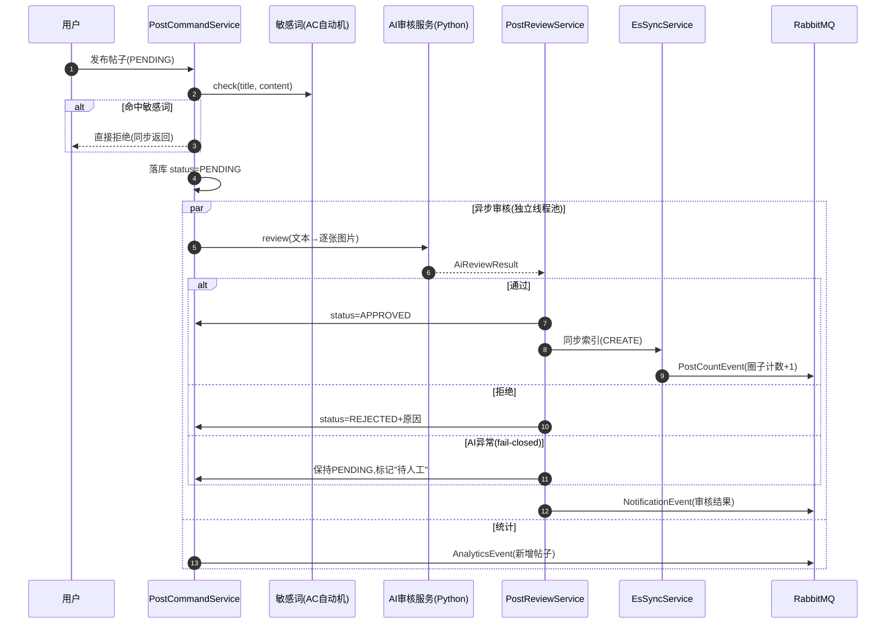
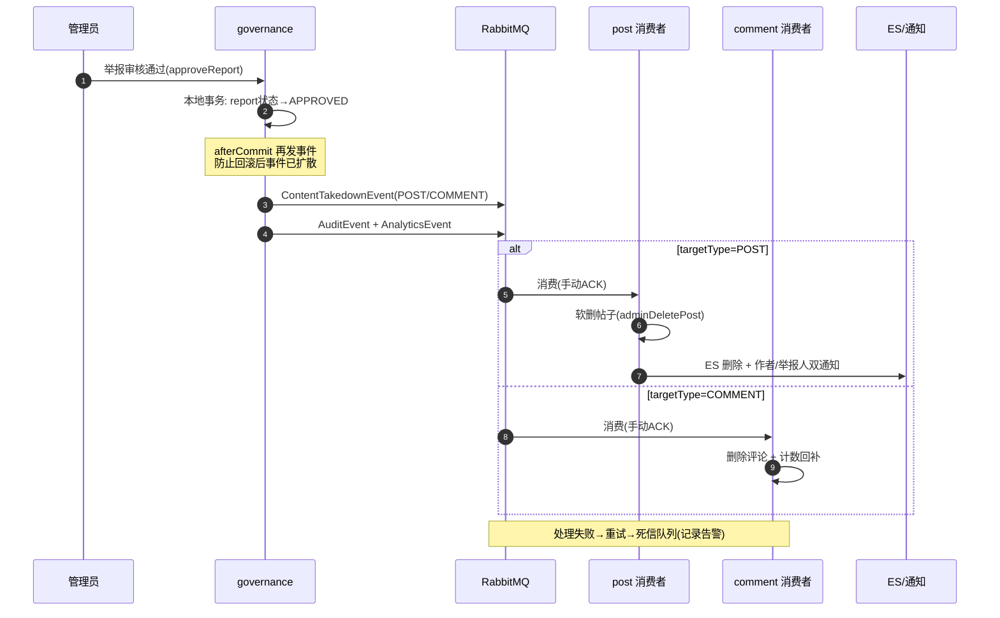
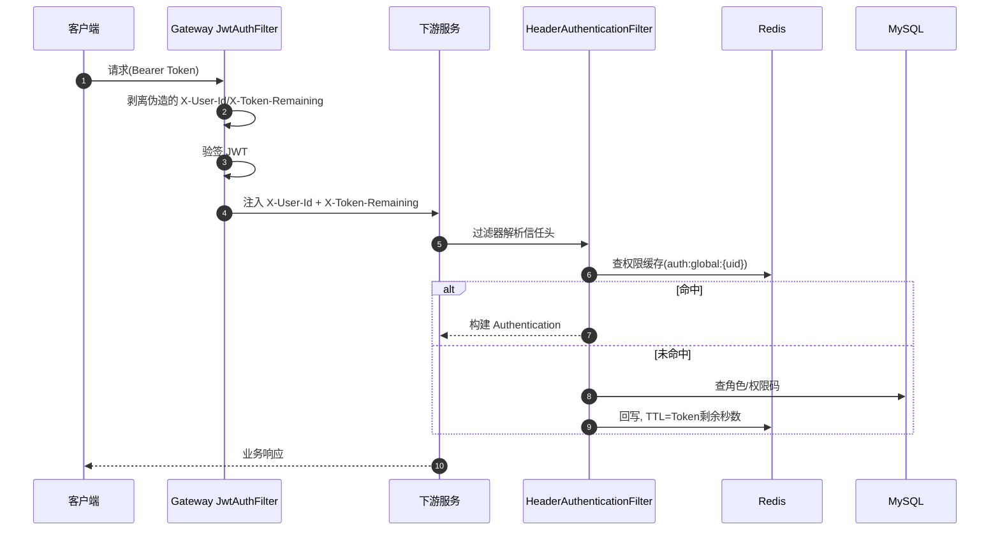
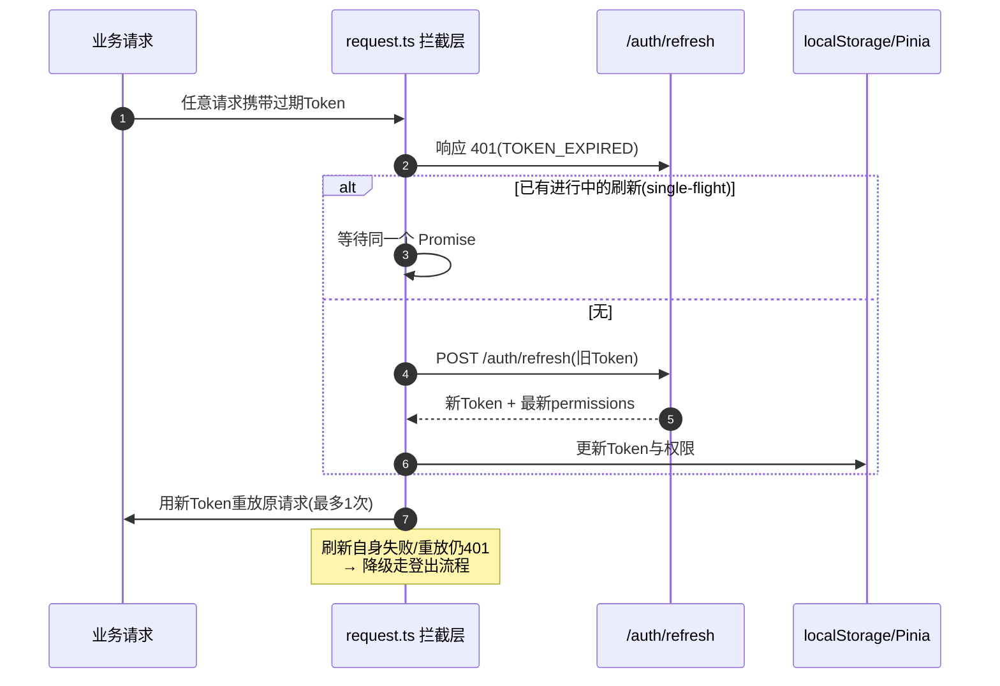
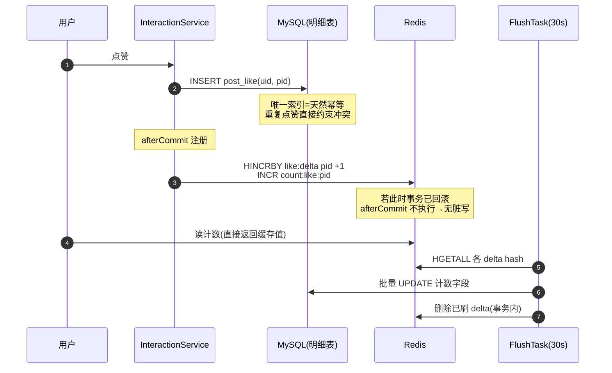
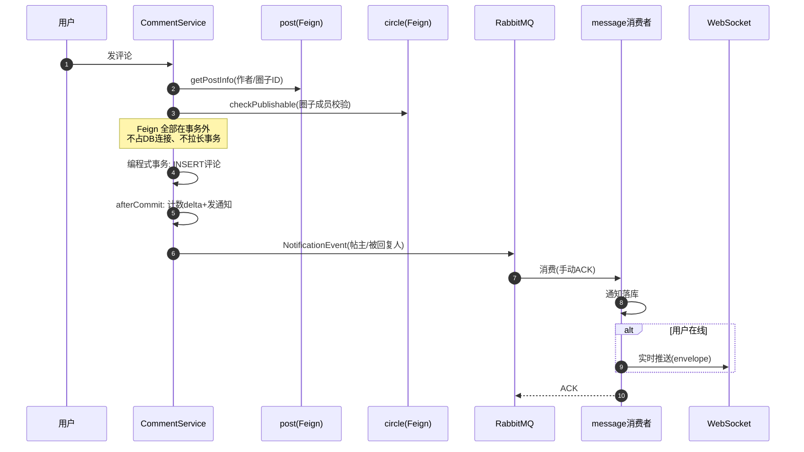
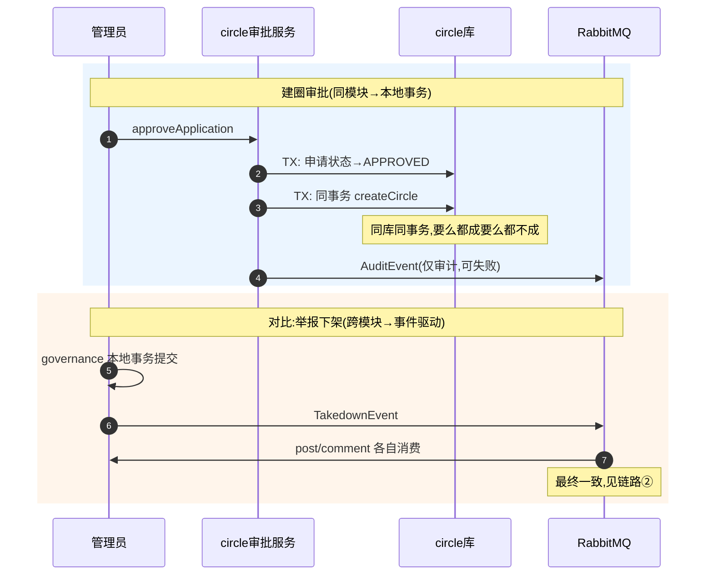
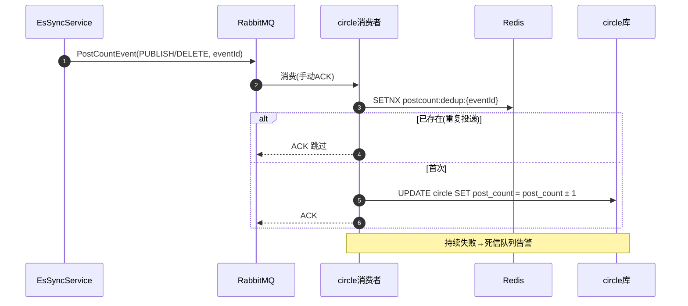
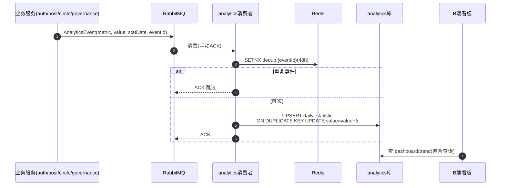

# 核心功能链路

> 最后更新：2026-08-17
>
> 本文档回答"功能怎么跑"。9 条跨服务核心链路，每条含时序图、设计决策与追问预演（FAQ）。
> 单服务的普通 CRUD 不在此列，功能索引见 [功能全景图.md](./功能全景图.md)。
>
> 通用可靠性底座（所有 MQ 消费者共享）：manual ACK + 本地重试 + 死信队列，见 `AbstractManualAckRabbitListener`。

---

## 链路① 发帖 → AI 审核 → 上架/ES 同步（含失败补偿）

用户发布帖子后经过三层内容安全检查，通过后异步同步 ES 并通知作者。

**设计决策**
- **三层内容安全**：敏感词（本地 AC 自动机，同步拦截）→ AI 初审（异步）→ 人工复审（后台 PENDING 列表兜底）
- **AI fail-closed**：AI 返回空/序列化失败一律视为拒绝或转人工，绝不放行——安全组件的失败方向必须朝"拒绝"而非"通过"
- **AI 调用走独立线程池 `aiReviewExecutor`**：Python 服务慢（秒级），与查询服务的并行 Feign 池隔离，避免互相拖垮
- **状态机 + CAS**：`canTransition` 校验合法迁移；人工审核用 `WHERE status=PENDING` 的条件更新，两人并发审核同一帖时后者 rows=0 报"已被处理"

**FAQ**
- Q: 为什么 AI 审核异步而不是同步？A: AI 秒级响应，同步会让发布接口 RT 不可控；且 fail-closed 策略下 AI 挂了帖子留在 PENDING 由人工兜底，发布体验不受影响
- Q: AI 审核通过还会被人工拒绝吗？A: 会，AI 通过直接上架，但举报链路（链路②）可事后下架——"先发后审"与"先审后发"的取舍按内容风险等级定，社区场景选 AI 前置 + 举报兜底
- Q: ES 同步失败怎么办？A: 见补偿机制——发送失败入 Redis 失败队列，30s 定时任务重试，保留原始 action（CREATE/DELETE）

---

## 链路② 举报 → 人工审核 → 下架事件三端联动

治理中心不直接写业务库，通过事件驱动 post/comment 服务自行处置。

**设计决策**
- **治理与业务解耦**：governance 只管举报单状态流转，删帖/删评由各自服务消费执行——各服务拥有自己数据的写权，不产生跨库写
- **afterCommit 发事件**：事务提交后才发 TakedownEvent，避免"DB 回滚但下架事件已扩散"的不可逆不一致
- **一条事件两个消费者按类型分流**：POST 事件 post 服务处理，COMMENT 事件 comment 服务处理，各自对不匹配类型静默跳过
- **软删而非物理删**：下架帖子置 DELETED 状态，可追溯可恢复；物理删除仅用户主动"自清"且从回收站发起（链路外的 hardDelete）

**FAQ**
- Q: 举报通过但 post 服务挂了，数据不一致怎么办？A: MQ 未 ACK 会重投；持续失败进死信队列留告警，人工介入。极端情况下举报单已 APPROVED 但帖子还在——概率极低且方向安全（内容多留一会儿），符合最终一致性取舍
- Q: 为什么不用 Seata？A: 跨服务写场景少且可异步，引入 Seata 的运维成本高于收益；用"本地事务 + afterCommit 事件 + 幂等消费"达到最终一致

---

## 链路③ 登录态请求 → 网关验签 → 权限缓存（TTL 跟随 Token）

每次请求经网关统一验签，下游服务按信任头加载权限，缓存寿命与 Token 对齐。

**设计决策**
- **信任头防伪造**：网关无条件剥离客户端传入的 X-User-Id / X-Token-Remaining，仅验签后由自己注入；下游服务只信网关
- **internal 接口网关层拒绝**：`/internal/**` 直接 403，Feign 走直连注册中心不经网关，服务间调用不受影响
- **缓存 TTL 对齐 Token 剩余时间（王牌设计）**：固定 TTL 两难——短了缓存白做，长了权限回收有延迟窗口。TTL = Token 剩余秒数，Token 失效缓存必然已过期，权限回收窗口 ≤ Token 寿命
- **降级方向安全**：Redis 挂了降级直查 DB（慢但可用）；DB 也挂则保持未认证拒绝放行（fail-closed）
- **Feign 透传 X-Token-Remaining**：服务间调用（如 post→circle 校验）也带剩余时间，下游缓存 TTL 不会超发

**FAQ**
- Q: 管理员改了用户权限，缓存什么时候生效？A: 双保险——权限变更主动删缓存 key（旁路失效）处理即时回收；TTL 兜底处理 Token 过期场景。最坏情况：主动删失败时，旧权限最多存活到 Token 过期
- Q: Token 剩余时间很长时缓存岂不是永不过期？A: roles/perms 共享 Hash key，任一 field 回写都会刷新 TTL，且主动失效路径独立存在；Token 续期（链路④）会换新 Token，缓存按新 Token 剩余时间重建

---

## 链路④ Token 过期 → 单飞续期 → 请求重放

前端请求层拦截 401，静默刷新 Token 并重放原请求，用户无感。

**设计决策**
- **single-flight 防并发刷新**：并发 N 个请求同时 401 时共享同一个刷新 Promise——后端 refresh 会拉黑旧 Token，第二次并发刷新拿到的旧 Token 已失效，会误判为"登录失效"踢出用户
- **`_retried` 防循环**：每个请求最多重放一次，重放后仍 401 说明刷新的新 Token 也无效（被踢/封禁），走登出
- **refresh 自身不触发续期**：`_skipAuthRefresh` 标记，刷新接口 401 直接登出，避免递归
- **续期顺带刷新权限**：后端 refresh 重查权限码并随响应返回，前端同步进 store——权限变更无需重新登录

**FAQ**
- Q: 为什么不用 refresh token 双令牌机制？A: 单 Token + 滑动续期对个人项目复杂度更合适；双令牌的安全增益（缩短访问令牌寿命）在无高价值资产场景下不划算。这是有意识的取舍
- Q: 旧 Token 拉黑和续期是什么关系？A: refresh 成功即拉黑旧 Token（Redis 黑名单），防止旧 Token 在续期后仍被使用；配合链路③的 TTL 设计，黑名单存续期 ≤ Token 剩余时间

---

## 链路⑤ 点赞/收藏/评论计数 → Redis 增量 → 定时刷库

互动计数走"DB 定明细 + Redis 聚合增量 + 异步落库"，读写路径分离。

**设计决策**
- **明细与计数分离**：post_like 明细表（唯一索引幂等）是事实源，计数字段是衍生数据，丢了可重算
- **afterCommit 写 Redis**：曾踩坑——事务内直接 HINCRBY，事务回滚后 Redis 留下脏计数。挪到 afterCommit 后回滚即不写
- **30s 批量刷库**：点赞一次只碰 Redis，DB 每 30s 按增量 hash 批量 UPDATE——热点帖子的点赞 QPS 不直接打 DB
- **计数读取直接走 Redis 缓存值**：未命中回源 DB 并回写，回源时刻天然吸收了刷库延迟

**FAQ**
- Q: Redis 增量写失败怎么办？A: catch 记日志放弃（本周期计数偏少），明细表仍正确——计数是衍生数据，可接受短时偏差，不做反向补偿
- Q: 刷库瞬间又有新点赞？A: 刷库读的是 delta hash 快照，刷完删 delta；期间新增的增量留在下一轮，不丢不重（删 delta 与 UPDATE 同事务）
- Q: 定时任务多实例重复执行？A: 当前单实例部署；多实例需引入分布式锁（ShedLock）——已知边界，列入演进项

---

## 链路⑥ 评论 → 事务后通知 → WebSocket 实时推送

评论落库与通知发送解耦，通知经 MQ 异步落库并推送在线用户。

**设计决策**
- **Feign 校验全部挪到事务外**：查帖子信息、圈子成员校验都是只读远程调用，放事务内会占 DB 连接等远程响应，拉长事务持有时间
- **通知在 afterCommit 发送**：回滚不发；且通知对象（帖主/被回复人）在同一事务内组装，避免事务外再查一次
- **两级去重通知**：自己评论自己的帖子不发（`userId.equals(postAuthorId)` 判断），回复通知与评论通知独立
- **落库成功才推送**：`createByEvent` 返回 true 才 pushIfOnline——推送失败仅记日志（下次拉取可见），落库失败则不 ACK 走重试

**FAQ**
- Q: 用户不在线通知丢吗？A: 不丢，通知已落库，用户上线拉列表；WS 推送只是"加速器"不是事实源
- Q: 为什么评论不像帖子一样 AI 审核？A: 评论区用敏感词 + 举报链路（链路②）治理，AI 审核成本（秒级延迟 + GPU 调用）不适合高频短内容——按内容形态分级治理

---

## 链路⑦ 建圈/入圈审批：本地事务 vs 事件驱动的取舍

两类审批流程展示"一致性手段按模块边界选择"。

**设计决策**
- **同模块写 → 本地事务**：申请表和圈子表同库，一个 `@Transactional` 直接保证强一致，不需要任何分布式手段
- **跨模块写 → 事件驱动**：governance 不可能持有 post 库连接，MQ 事件 + 幂等消费 + 死信兜底是唯一合理选择
- **MQ 只承载"允许失败"的通知**：审批落库后的 AuditEvent/通知发送全部 try-catch——审计缺一条可接受，审批主流程不为它回滚
- **入圈审批同理**：申请表与成员表同库同事务；通知作者走 MQ

**FAQ**
- Q: 为什么不统一都用 MQ？A: 同库场景用 MQ 反而引入不必要的最终一致窗口和消费端幂等成本。"一致性手段跟着数据边界走"是本条链路的核心论点
- Q: 审批并发重复处理？A: `checkPending` 校验 + 状态条件更新（CAS 思路），重复审批报"已处理"

---

## 链路⑧ 帖子发布/删除 → PostCountEvent → 圈子计数（破循环依赖）

帖子数统计从"定时 Feign 全量拉取"重构为事件驱动增量更新。

**设计决策**
- **破除循环依赖**：原方案 circle 定时 Feign 调 post 拉帖子数——但 post 发帖又要调 circle 校验（链路①），形成环。事件反转依赖方向：post 发事件，circle 自己消费
- **SETNX + eventId 幂等**：MQ at-least-once 语义下消息可能重投，`postcount:dedup:{eventId}`（24h TTL）保证同一事件只生效一次
- **增量而非全量**：`post_count = post_count ± 1` 一条 UPDATE，对比全量 COUNT(*) 扫帖表，写放大可控
- **仅 APPROVED 状态变化才发事件**：草稿/拒绝不发；软删时仅原状态为 APPROVED 才发 DELETE——状态机保证计数对称

**FAQ**
- Q: 计数漂移怎么办（事件全丢）？A: 死信队列有告警；兜底方案是保留的 `batch-circle-post-count` internal 接口可手动对账——事件为主、查询为辅的混合架构
- Q: 为什么消费端在 circle 而不是 post？A: 谁的数据谁消费（数据所有权原则），post 不应直写 circle 库

---

## 链路⑨ 统计事件 → eventId 幂等 → 日聚合看板

全站指标经统一事件管道进入 analytics 服务，日粒度聚合成看板。

**设计决策**
- **四层幂等之一环**：统计场景的幂等 = 事件层 SETNX（挡重投）+ 存储层 UPSERT 唯一索引（挡并发与漏网），双重保险
- **为什么加 eventId**：曾踩坑——AnalyticsEvent 无标识，MQ 重投时同一指标被累加两次，看板虚高。补 eventId 字段 + 消费端 SETNX 后修复
- **日粒度建模**：`stat_date + metric + value`，看板查询按日期范围聚合，无实时明细表——统计场景容忍 T+0 延迟换取写放大极小
- **发布侧弱可靠**：统计事件发送失败仅记日志不补偿——统计是衍生数据，缺一条远比重复一条无害（方向不对称）

**FAQ**
- Q: 为什么 SETNX TTL 48h？A: 覆盖 MQ 最长重试窗口（重试 + 死信前的总时长）并留余量；过长浪费 Redis 内存
- Q: 未来做创作者中心怎么扩展？A: 事件加 userId 维度，消费端按维度分流到 user_daily_statistic 表（唯一索引 `(user_id, stat_date, metric)`），管道与幂等设计全复用——已列入演进项

---

## 附：四层幂等手段总览

| 层 | 手段 | 典型场景 |
|---|---|---|
| 接口层 | 前端防重提交 + 后端参数校验 | 发布、举报 |
| 数据库层 | 唯一索引 / UPSERT / 条件更新(CAS) | 点赞明细、统计聚合、状态迁移 |
| 缓存层 | SETNX + eventId(TTL) | MQ 消费去重 |
| 业务层 | 状态机 canTransition | 审核、审批流程 |

> 同一业务按风险组合多层：如"点赞"= 唯一索引(必) + afterCommit(防脏写)；"统计"= SETNX + UPSERT(双保险)。
