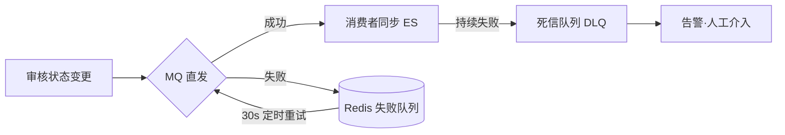

# 技术亮点详解

> 最后更新：2026-08-17
>
> 本文档是 README 中一句话亮点的下钻层，每张卡片按"问题 → 方案 → 不这么做会怎样 → FAQ"组织，供深入复习与面试展开。
> 流程类亮点见 [核心功能链路.md](../功能设计/核心功能链路.md)。
>
> 分档：**王牌**（主动讲）/ **主推**（被问相关话题时讲）/ **备查**（面试官点名才展开）。

---

## 王牌① 权限缓存 TTL 跟随 Token 剩余时间

**问题**：网关统一鉴权后，下游服务每次请求都要查用户角色/权限。加缓存面临两难——TTL 太短缓存命中率低等于白做；TTL 太长则权限回收有延迟窗口（管理员降权后，用户还能带旧权限操作）。

**方案**：网关验签时解析 JWT 剩余有效期，注入 `X-Token-Remaining` 信任头；下游服务权限缓存（Cache-Aside）回写 Redis 时 TTL 直接取该值。权限缓存与 Token 同生共死。

**不这么做会怎样**：固定 30min TTL 意味着降权最坏延迟 30min 生效；固定 5min TTL 意味着高峰期权限缓存形同虚设。

**FAQ**
- Q: 权限变更的即时回收靠什么？A: 主动删缓存 key（旁路失效）负责"权限变了"，TTL 跟随负责"Token 过期了"，双保险各管一半场景。
- Q: Feign 链路上 TTL 会不会算错？A: FeignConfig 透传 X-Token-Remaining（曾踩坑：不透传时下游拿不到该头，TTL 回退默认值），同一次请求内剩余时间一致。
- Q: Token 续期后旧缓存怎么办？A: 续期换发新 Token，剩余时间变长；旧缓存自然过期后按新 TTL 重建，不存在超发窗口。

**关联**：`JwtAuthFilter` · `GlobalPermissionProviderImpl` · `TokenTtlContext` · `FeignConfig` · 链路③

---

## 王牌② 四层幂等体系（按风险组合，不堆砌）

**问题**：微服务 + MQ 的 at-least-once 语义下，用户重试、网关重发、MQ 重投都会造成重复写。单一手段（如只靠前端防抖）挡不住所有层。

**方案**：接口层（前端防重 + 参数校验）→ 数据库层（唯一索引 / UPSERT / 条件更新）→ 缓存层（SETNX + eventId）→ 业务层（状态机）。每个写路径按风险组合必要层数：

| 业务 | 组合 | 理由 |
|---|---|---|
| 点赞 | 唯一索引 + afterCommit | 明细表天然幂等，计数是衍生数据 |
| 审核动作 | 状态机 + CAS 条件更新 | 防并发重复审核 |
| 统计聚合 | SETNX + UPSERT 双保险 | 重投与并发都要挡，看板不能虚高 |
| 计数事件 | SETNX(eventId, 24h) | 增量更新最怕重复消费 |

**不这么做会怎样**：曾实际踩坑两处——AnalyticsEvent 无 eventId，MQ 重投看板虚高；计数增量在事务内执行，回滚后 Redis 留脏数据。修复过程本身就是面试素材。

**FAQ**
- Q: 为什么不统一上分布式锁？A: 锁解决"并发互斥"不解决"重复请求判定"；且唯一索引/UPSERT 由数据库保证，比应用层锁更可靠、零运维。
- Q: SETNX 的 TTL 怎么定？A: 覆盖 MQ 最长重试总窗口并留余量（统计 48h / 计数 24h），过长浪费内存、过短挡不住慢重投。

**关联**：`PostLikePO` 唯一索引 · `PostCountConsumer` · `AnalyticsEventConsumer` · `PostStatus.canTransition` · 链路⑤⑧⑨附录

---

## 王牌③ ES 同步失败补偿链（Redis 失败队列 + 定时重试 + 死信）

**问题**：帖子审核通过后要同步 ES 索引。MQ 发送瞬间失败（broker 抖动）若直接丢弃，帖子"已上架但搜不到"，且无自动恢复路径。

**方案**：三级兜底——① 正常路径直发 MQ；② 发送异常时把原始事件（保留 CREATE/DELETE action）写入 Redis 失败队列，30s 定时任务重投；③ 消费端持续失败进死信队列，死信监听只记日志告警不再重试（防毒丸消息）。

**不这么做会怎样**：曾踩坑——失败入队时 action 硬编码为 CREATE，下架帖子的 DELETE 事件进队列后变成"重新创建"，越补偿越错。修复：事件对象在 try 块外按真实 action 构造好，失败入队的就是原样事件。

**FAQ**
- Q: 重试会不会重复同步？A: ES 文档写入按 postId 幂等（同 ID 覆盖），CREATE/DELETE 语义由 status 决定，重复消费无害。
- Q: 终极一致性兜底？A: 保留 `batch-circle-post-count` 等 internal 接口可手动对账；全量对账任务（ES scroll vs DB）列入演进项。

**关联**：`PostEsSyncService` · `PostEsSyncRetryTask` · 链路①

---

## 主推① afterCommit 防 Redis 脏写

**问题**：点赞/评论的计数增量写在 `@Transactional` 方法内，若事务随后回滚，DB 明细未变但 Redis 已加一——计数永久性偏大。

**方案**：`TransactionUtils.afterCommit()` 把 Redis 写操作注册为事务提交后回调；无事务上下文时立即执行（工具方法兼容两种场景）。

**不这么做会怎样**：偶发回滚（如通知组装异常）产生无法自愈的计数偏差，因为明细与计数从此不对称。

**FAQ**
- Q: afterCommit 里 Redis 写失败呢？A: catch 记日志放弃——计数是衍生数据，本周期偏少可接受，明细表才是事实源。
- Q: 哪些操作适合挪 afterCommit？A: 一切"事务外副作用"：Redis 写、MQ 发送、ES 同步。本项目举报审批、评论通知、硬删的跨服务清理全部同款处理。

**关联**：`TransactionUtils` · `PostInteractionServiceImpl` · `CommentServiceImpl` · `ReportServiceImpl` · 链路②⑤⑥

---

## 主推② 状态机 + CAS 条件更新防并发覆盖

**问题**：帖子状态流转（草稿→待审→通过/拒绝→删除）若只做"读-改-写"，两个并发请求会互相覆盖（如审核通过与用户自删并发，后写者赢，状态错乱）。

**方案**：① `PostStatus.canTransition(from, to)` 白名单校验合法迁移；② 更新用 `UPDATE ... WHERE id=? AND status=原状态`，rows=0 即抛"状态已被修改，请刷新"。

**不这么做会怎样**：经典 lost update——并发窗口内一方静默丢失更新，且无任何报错。

**FAQ**
- Q: 和乐观锁版本号比呢？A: 本质相同（都是 CAS），条件更新省掉 version 字段，以"状态本身"做版本；缺点是一张表只有一个可 CAS 维度，多维度并发才需要 version。
- Q: 已知边界？A: AI 审核回调路径当前未加 CAS（`updateById` 全量写）——评估过触发概率（AI 回调与人工审核同毫秒并发）极低且最坏结果是重复通知，列为已知取舍。

**关联**：`PostStatus` · `PostCommandService.updatePost` · `PostReviewService.approvePost` · 链路①

---

## 主推③ 线程池隔离（AI 慢任务与在线查询分池）

**问题**：AI 审核调用 Python 服务秒级耗时，若与 Feign 并行查询共享线程池，AI 慢请求占满线程后帖子列表等在线接口全部排队超时。

**方案**：`aiReviewExecutor` 独立线程池专跑 AI 审核；查询类并行 Feign 走另一池。池参数按任务类型分别设定，互不侵占。

**不这么做会怎样**：AI 服务一抖动，全站查询跟着雪崩——典型舱壁模式（bulkhead）缺失事故。

**FAQ**
- Q: 为什么不用 MQ 承载 AI 审核？A: 可以，但 AI 结果要回写本服务 DB，MQ 方案要引入"结果回传"通道；线程池方案链路短、延迟低，且 fail-closed 兜底已覆盖 AI 挂掉的场景。量级大了再演进为 MQ。

**关联**：`PostCommandService`（@Qualifier 注入）· 链路①

---

## 主推④ AI 审核 fail-closed 策略

**问题**：AI 审核服务（Python + 模型推理）不稳定时，返回空响应/序列化失败怎么处理？放行则违规内容自动上架，拒绝则可用性归零。

**方案**：fail-closed——任何异常一律不放行：序列化失败→拒绝；响应空→拒绝；调用异常→保持 PENDING 转人工（既不放行也不误杀）。安全组件的失败方向必须朝"拒绝"。

**不这么做会怎样**：fail-open 意味着 AI 服务挂掉的瞬间全站内容免审上架，内容安全事故。

**FAQ**
- Q: 转 PENDING 会不会堆积？A: 会进人工审核队列，后台 PENDING 列表就是为这个兜底设计的；AI 恢复后新帖自动走 AI。
- Q: 图片审核怎么做？A: 文本先审，再逐张调图片审核接口，任一不通过整体拒绝——最严路径。

**关联**：`AiReviewService` · `PostReviewService.handleReviewFailure` · 链路①

---

## 主推⑤ 前端 Token 单飞续期（single-flight）

**问题**：Token 过期瞬间页面上多个并发请求同时收到 401。若各自独立刷新：第一次刷新成功即拉黑旧 Token，第二次刷新拿着已拉黑的旧 Token 必然失败，用户被误踢出。

**方案**：请求层维护进行中的刷新 Promise，并发 401 共享同一 Promise；成功后更新 store 并重放原请求（每请求限重放一次）；刷新自身失败/重放仍 401 才降级登出。

**不这么做会怎样**：多 tab/多请求场景随机登出，且难以复现排查。

**FAQ**
- Q: 为什么旧 Token 要拉黑？A: 防止续期后旧 Token 继续有效（被盗 Token 无法通过续期延续）；拉黑存续期 ≤ Token 剩余时间，到期自动清理。
- Q: 权限怎么跟着更新？A: 后端 refresh 重查权限码随响应返回，前端同步进 Pinia——权限变更无需重登。

**关联**：`request.ts` · `AuthServiceImpl.refresh` · 链路④

---

## 主推⑥ 事件驱动破除循环依赖

**问题**：circle 需要"圈内帖子数"展示，最直觉方案是 circle 定时 Feign 调 post 全量 COUNT。但 post 发帖又要 Feign 调 circle 校验发布权限——circle ⇄ post 成环，Maven 模块间无法互相依赖 api。

**方案**：依赖反转——post 在帖子 APPROVED/DELETED 时发 `PostCountEvent`，circle 自己消费并增量更新 `post_count`。circle 不再依赖 post，环消失。

**不这么做会怎样**：要么循环依赖编译不过（api 模块成环），要么把计数逻辑塞进 common 造成上帝模块。

**FAQ**
- Q: 全量拉取方案错在哪？A: 除了依赖问题，定时 COUNT 是全表扫描级写放大；事件增量一条 UPDATE 搞定，且实时性从"分钟级轮询"变"秒级"。
- Q: 事件丢了计数漂移？A: 死信告警 + 保留 internal 对账接口，事件为主查询为辅。

**关联**：`PostCountEvent` · `PostCountConsumer` · 链路⑧

---

## 备查① 登录防时间侧信道攻击

**问题**：用户名不存在时若直接返回"用户不存在"，攻击者可枚举注册用户；且不存在用户不做 BCrypt 比对，响应时间显著短于真实用户，同样泄露信息。

**方案**：用户不存在时构造 dummy BCrypt 哈希做一次相同开销的比对，保证两种失败路径（用户不存在/密码错误）响应时间一致，错误信息统一"用户名或密码错误"。

**关联**：`AuthServiceImpl.login`

## 备查② 登录接口 IP 失败限流

**问题**：登录接口暴力破解。

**方案**：Redis 记录 IP 维度失败次数窗口，超阈值锁定；配合验证码前置。RedisRateLimiter 网关层另有限流（压测报告验证过阈值）。

**关联**：`RateLimitConfig` · 压测报告

## 备查③ 敏感词 AC 自动机

**问题**：敏感词库数千条，逐条 `contains` 匹配 O(词数×文本长)。

**方案**：Aho-Corasick 自动机一次扫描匹配全部词表，复杂度 O(文本长)。词库加载后构建失败指针，运行期纯内存匹配，作为 AI 审核前置的同步拦截层。

**关联**：`SensitiveWordService` · 链路①

## 备查④ Feign FallbackFactory 降级

**问题**：被调服务不可用时调用方如何表现。

**方案**：FallbackFactory 记录异常上下文返回降级结果；安全相关调用（圈子成员校验）**不假成功**——降级即抛"服务不可用"，避免越权发布/评论。降级策略按业务语义分级：展示类可兜底空数据，权限类必须 fail-fast。

**关联**：各服务 FeignClient 配置 · 链路①⑥

## 备查⑤ Docker 一键编排

13 个 Java 服务 + Python AI + Nacos/RabbitMQ/Redis/MySQL/nginx 前端，docker-compose 统一编排，依赖健康检查控制启动顺序，双模式（开发全量/演示精简）启动脚本。

**关联**：根 README 部署章节

---

## 亮点讲述优先级建议

面试开场自我介绍带出**王牌①**（自研设计，区分度最高）→ 项目介绍时按链路①②自然嵌入**王牌③、主推④**→ 被问"遇到过什么难题"时用王牌②的两处真实踩坑（统计虚高 / Redis 脏写）→ 其余卡片按面试官提问方向取用。
